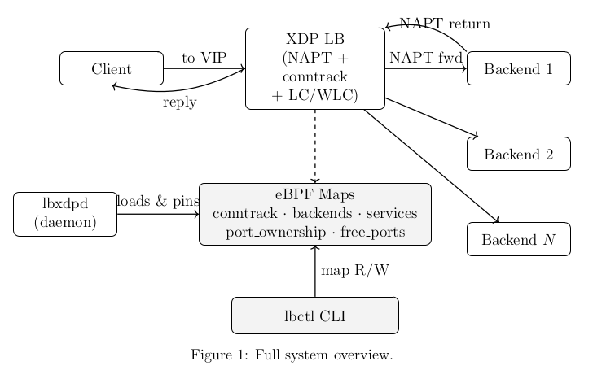
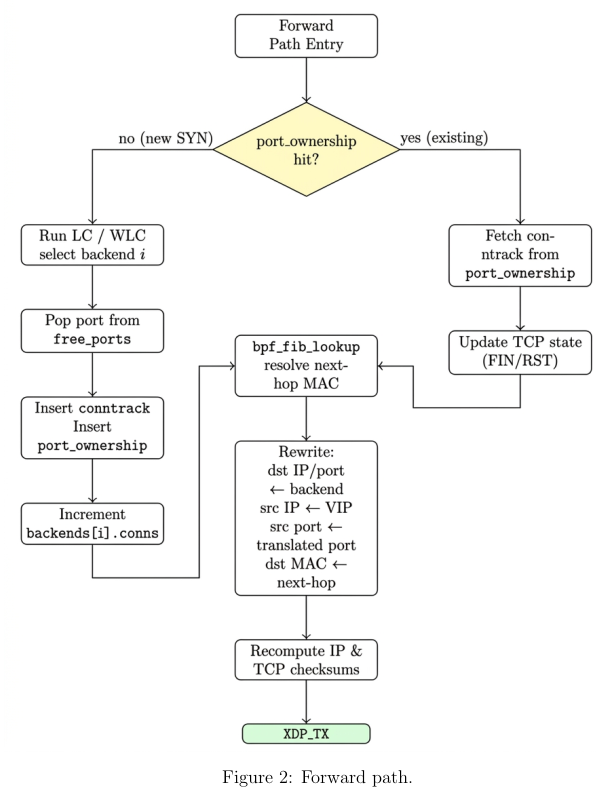
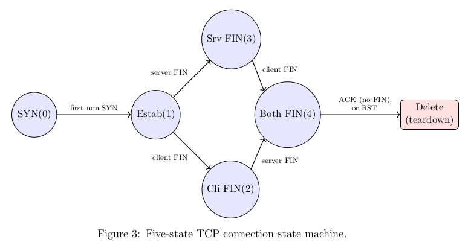
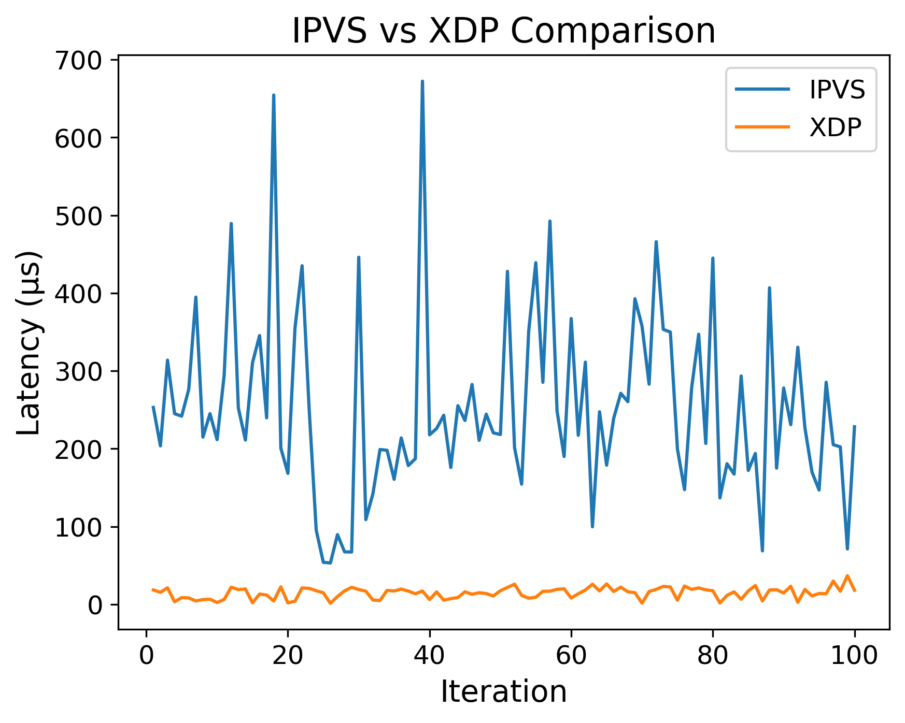

# XDP Layer-4 NAT Load Balancer

A high-performance Layer-4 NAT based load balancer built in the XDP/eBPF fast path, providing stateful connection-aware scheduling with full NAT semantics.

The dataplane performs connection tracking, backend selection, and bidirectional address rewriting entirely before packets enter the Linux networking stack, enabling low-latency and high-throughput load distribution under heavy connection concurrency.

> Benchmarked against Linux IPVS, the XDP dataplane achieves **~19× lower average forwarding latency** — and the true advantage is larger still, as the measurement excludes skb allocation, GRO, and netfilter/conntrack overhead that IPVS pays but XDP bypasses entirely.

The system supports Least-Connections (LC), Weighted Least-Connections (WLC), Round-Robin (RR), and Weighted Round-Robin (WRR) scheduling, each available with selectable connection accounting modes. It is structured as a long-running daemon that loads and owns the BPF program, and a separate control CLI that communicates with the daemon at runtime — without ever restarting the dataplane.

Traffic is steered only for configured services, allowing unrelated network flows to pass through the interface unaffected.

> **Why XDP?** Packets are processed before entering the Linux networking stack — minimal CPU overhead, maximum throughput.

---

## Table of Contents

- [Overview](#overview)
- [Key Capabilities](#key-capabilities)
- [Scheduling Algorithm Comparison](#scheduling-algorithm-comparison)
- [Suitable Deployment Scenarios](#suitable-deployment-scenarios)
- [Flow Diagrams](#flow-diagrams)
- [Scheduling Algorithms](#scheduling-algorithms)
- [Connection Tracking Modes](#connection-tracking-modes)
- [Repository Structure](#repository-structure)
- [Prerequisites](#prerequisites)
- [Configuration](#configuration)
- [Building](#building)
- [Running](#running)
- [Runtime CLI](#runtime-cli)
- [Latency Benchmarking](#latency-benchmarking)
- [Testing Workload](#testing-workload)
- [Customization](#customization)
- [References](#references)

---

## Overview

This project implements a stateful Layer-4 load balancer with full network address translation (NAT) in the eBPF/XDP fast path.
Incoming TCP flows destined for configured virtual service endpoints (VIP–port pairs) are intercepted at the earliest point in the Linux receive path and dynamically steered to backend servers using adaptive connection-aware scheduling.

Unlike stateless hashing-based dataplane designs, the load balancer maintains per-connection state directly inside eBPF maps, enabling real-time backend selection based on active connection counts and configurable backend weights.
Both forward and reverse packet paths are rewritten entirely in the XDP layer, providing complete NAT semantics including source-port translation, symmetric return routing, and deterministic connection teardown handling.

The system is split into two components:

- **`lbxdpd`** — a long-running daemon that loads the BPF program, attaches it to the network interface, initialises backend state from a config file, and pins the BPF maps to the filesystem so external tools can reach them. The daemon selects its scheduling algorithm and connection tracking mode at startup via flags. WLC and WRR modes additionally expose a gRPC control server over a Unix socket for live weight updates.
- **`lbctl`** — a standalone control CLI that reads and writes the pinned BPF maps directly for backend and service operations, and connects to the gRPC socket for weight updates. It requires no daemon restart and works against whichever daemon is currently running.

Because all packet classification, scheduling, connection tracking, and address rewriting occur before socket buffer allocation, the design achieves very low processing latency and high throughput under connection-heavy workloads.

---

## Key Capabilities

- Least-Connections, Weighted Least-Connections, Round-Robin, and Weighted Round-Robin scheduling
- In-datapath TCP connection tracking
- Full NAT (forward and reverse path rewriting)
- Multiple virtual services (VIP–port endpoints) with runtime add/remove support
- Runtime backend addition and removal via `lbctl` without dataplane restart
- Live weight updates on WLC/WRR backends via gRPC, applied instantly without connection disruption
- Stable traffic distribution under bursty or long-lived connections

Because scheduling decisions are made using real-time connection counts (LC/WLC) or a deterministic rotation (RR/WRR), the load balancer adapts automatically to uneven traffic patterns and backend capacity differences while retaining the performance benefits of early ingress processing with XDP.

---

## Scheduling Algorithm Comparison

Hash-based load balancing is common in fast datapaths because it requires no state and makes O(1) decisions. But it has a fundamental problem: **it distributes flows, not load**. When connections have unequal lifetimes or throughput, a hash-balanced backend pool can become heavily skewed. Adjusting weights in a hashing scheme also requires remapping flows, which causes traffic churn and connection disruption.

This project implements four stateful alternatives, each trading a small amount of per-connection overhead for meaningfully better distribution fairness:

```
┌─────────────────────────────────────────────────────────────────────┐
│              Scheduling Algorithm Trade-offs                        │
├──────────────┬──────────────────────┬──────────────────────────────┤
│  Algorithm   │   Load Accuracy      │  Overhead / Use Case         │
├──────────────┼──────────────────────┼──────────────────────────────┤
│  Hash        │ ✗ Flow-count only    │ Minimal — but unfair under   │
│              │   Blind to duration  │ skewed or long-lived conns   │
├──────────────┼──────────────────────┼──────────────────────────────┤
│  RR          │ ✓ Even rotation      │ Low — great for short-lived  │
│              │   Ignores live load  │ homogeneous workloads        │
├──────────────┼──────────────────────┼──────────────────────────────┤
│  WRR         │ ✓ Weighted rotation  │ Low — proportional for       │
│              │   Ignores live load  │ heterogeneous capacity       │
├──────────────┼──────────────────────┼──────────────────────────────┤
│  LC          │ ✓✓ Live conn count   │ Medium — best fairness for   │
│              │    Adapts in real    │ persistent/mixed workloads   │
│              │    time              │                              │
├──────────────┼──────────────────────┼──────────────────────────────┤
│  WLC         │ ✓✓ Weighted live     │ Medium — proportional AND    │
│              │    conn count        │ adaptive; heterogeneous      │
│              │    Adapts in real    │ backends with mixed load     │
│              │    time              │                              │
└──────────────┴──────────────────────┴──────────────────────────────┘

  Hash → always fast, never fair under skew
  RR/WRR → fast, fair for uniform short-lived connections
  LC/WLC → slower to decide, genuinely fair under any workload
```

**In short:**
- Use **RR** when connections are short-lived and backends are equal — simple, fast, and better than hashing.
- Use **WRR** when backends have different capacity but connections are short-lived and relatively uniform.
- Use **LC** when connection lifetimes are uneven or unpredictable — it reacts to real load, not just connection counts.
- Use **WLC** when backends are heterogeneous in capacity AND connection lifetimes are long or skewed — maximum fairness at the cost of slightly more state.

---

## Suitable Deployment Scenarios

- **Backend identity must remain private** — Full NAT hides real server IPs and prevents clients from directly addressing backend nodes.
- **Controlled ingress or gateway-style deployments** — Centralised entry point simplifies firewalling, policy enforcement, and network segmentation.
- **Persistent or long-lived connection workloads** — LC/WLC provide better distribution than hash or RR-based scheduling for WebSockets, streaming services, or database sessions.
- **Heterogeneous backend capacity** — WLC and WRR enable proportional load distribution across unequal servers.
- **High concurrent connection environments** — XDP fast-path processing keeps per-packet overhead low even with stateful scheduling.
- **Short-lived, uniform workloads** — RR and WRR offer a lightweight alternative to hashing with fairer rotation semantics.

---
## Flow Diagrams





---

## Scheduling Algorithms

| Algorithm | Description |
|-----------|-------------|
| **Least Connections (LC)** | Assigns each new connection to the backend with the fewest active connections. All backends are treated equally. Best for uneven or long-lived workloads. |
| **Weighted Least Connections (WLC)** | Assigns connections based on `active_connections / weight`. Backends with higher weights receive a proportionally larger share of traffic. Adapts to live load. |
| **Round Robin (RR)** | Assigns connections to backends in a fixed rotation. All backends receive an equal share over time. Fast and stateless per-decision; ideal for short-lived, uniform connections. |
| **Weighted Round Robin (WRR)** | Extends RR with per-backend weights, distributing connections proportionally. Backends with higher weights are selected more frequently in the rotation cycle. |

---

## Connection Tracking Modes

All four algorithms are available in two builds, differing only in *when* a connection is counted:

| Mode | Counts on | Pros | Cons |
|------|-----------|------|------|
| **SYN** | SYN packet arrival | Reserves backend immediately; more even distribution during bursts | Incomplete handshakes are briefly counted until cleaned up |
| **Established** | First non-SYN packet (after handshake completes) | Counters reflect only fully established connections | Under burst load, multiple SYNs may see stale counters before they update |

---

## Repository Structure

```
.
├── bin/                        # Built binaries (ignored in git)
│   └── lbctl                   # CLI tool
│   └── lbxdpd                  # Unified daemon (all algorithms)
├── bpf/                        # eBPF/XDP programs (C source)
│   ├── lb_lc_est.c             # Least Connections (established-mode)
│   ├── lb_lc_syn.c             # Least Connections (SYN-mode)
│   ├── lb_wlc_est.c            # Weighted LC (established-mode)
│   ├── lb_wlc_syn.c            # Weighted LC (SYN-mode)
│   ├── lb_rr_est.c             # Round Robin (established-mode)
│   ├── lb_rr_syn.c             # Round Robin (SYN-mode)
│   ├── lb_wrr_est.c            # Weighted Round Robin (established-mode)
│   ├── lb_wrr_syn.c            # Weighted Round Robin (SYN-mode)
│   ├── parse_helpers.h         # Packet parsing helpers
│   └── vmlinux.h               # BTF header for CO-RE
├── cmd/
│   ├── lbctl/                  # CLI — interacts with maps + gRPC
│   │   ├── main.go
│   │   └── mapmode.go
│   └── lbxdpd/                 # Unified daemon (variant-based)
│       ├── main.go
│       ├── ports.go
│       └── variants.go
├── configs/
│   ├── backends_lc.json        # Backend config (LC / RR — no weights)
│   ├── backends_wlc.json       # Backend config (WLC with weights)
│   ├── backends_rr.json        # Backend config (RR — same format as LC)
│   └── backends_wrr.json       # Backend config (WRR with weights)
├── proto/
│   ├── control.proto           # gRPC service definition
│   └── *.pb.go                 # Generated protobuf bindings (ignored)
├── scripts/
│   ├── build.sh                # Build all binaries
│   ├── gen.sh                  # Generate eBPF + protobuf bindings
│   └── llvm.sh                 # Install LLVM/Clang dependencies
├── go.mod
├── go.sum
└── README.md
```

The system is split into two binaries:

| Binary | Role |
|--------|------|
| `lbxdpd` | Unified daemon — selects algorithm and mode at startup via `-algo` and `-mode` flags |
| `lbctl` | Control CLI — reads pinned maps for backend/service operations; uses gRPC for live weight updates (WLC/WRR only) |

---

## Prerequisites

Install LLVM and required toolchain dependencies:

```bash
sudo ./scripts/llvm.sh
```

> **Requirements:** Root privileges, a modern Linux kernel with eBPF and XDP support.

---

## Configuration

The load balancer is configured at startup using a JSON file specifying the virtual service endpoint (VIP + port) and the initial backend pool. Backends and services can also be added, removed, or reweighted live via `lbctl` after startup.

### LC / RR — `configs/backends_lc.json` / `configs/backends_rr.json`

```json
{
  "service": {
    "vip": "10.45.179.173",
    "port": 8000
  },
  "backends": [
    { "ip": "10.45.179.166", "port": 8000 },
    { "ip": "10.45.179.99",  "port": 8000 }
  ]
}
```

### WLC / WRR — `configs/backends_wlc.json` / `configs/backends_wrr.json`

```json
{
  "service": {
    "vip": "10.45.179.173",
    "port": 8000
  },
  "backends": [
    { "ip": "10.45.179.166", "port": 8000, "weight": 80 },
    { "ip": "10.45.179.99",  "port": 8000, "weight": 20 }
  ]
}
```

> **Note:** The `weight` field is ignored in LC and RR modes. It defaults to `1` if omitted in WLC/WRR modes.

---

## Building

```bash
./scripts/build.sh
```

This runs code generation (eBPF bindings + protobuf) and produces two binaries in `bin/`:

| Binary | Description |
|--------|-------------|
| `lbxdpd` | Unified daemon — handles all four algorithms |
| `lbctl` | Control CLI |

---

## Running

Start the daemon first. It loads the correct BPF program variant, attaches it to the interface, and pins the maps so `lbctl` can reach them.

The daemon is controlled entirely through flags:

```
-i <interface>     Network interface to attach XDP to (e.g. eth0, ens3)
-algo <algo>       Scheduling algorithm: lc, wlc, rr, wrr  (default: lc)
-mode <mode>       Connection tracking mode: est, syn       (default: est)
-config <path>     Path to backends JSON config
-sock <path>       gRPC Unix socket path (default: /var/run/lbxdpd.sock)
```

### Least Connections (LC)

```bash
sudo ./bin/lbxdpd -i eth0 -algo lc -mode syn -config configs/backends_lc.json
sudo ./bin/lbxdpd -i eth0 -algo lc -mode est -config configs/backends_lc.json
```

### Weighted Least Connections (WLC)

```bash
sudo ./bin/lbxdpd -i eth0 -algo wlc -mode syn -config configs/backends_wlc.json
sudo ./bin/lbxdpd -i eth0 -algo wlc -mode est -config configs/backends_wlc.json
```

### Round Robin (RR)

```bash
sudo ./bin/lbxdpd -i eth0 -algo rr -mode syn -config configs/backends_lc.json
sudo ./bin/lbxdpd -i eth0 -algo rr -mode est -config configs/backends_lc.json
```

### Weighted Round Robin (WRR)

```bash
sudo ./bin/lbxdpd -i eth0 -algo wrr -mode syn -config configs/backends_wlc.json
sudo ./bin/lbxdpd -i eth0 -algo wrr -mode est -config configs/backends_wlc.json
```

Replace `eth0` with the interface you want to attach to (e.g. `wlo1`, `ens3`).

The recommended mode is `-mode syn` for bursty workloads. Use `-mode est` for stable, long-lived connection workloads.

Once the daemon is running, use `lbctl` in a separate terminal.

---

## Runtime CLI — Structured Reference

`lbctl` determines the running algorithm automatically by reading `/run/lbxdp.mode`, which the daemon writes at startup. No algorithm flag is needed.

### Backend operations

| Command | Syntax | Algorithms | Description | Notes |
|--------|--------|------------|-------------|-------|
| Add backend | `sudo ./bin/lbctl add <ip> <port> [weight]` | All | Inserts a backend server into the pinned BPF backend map | `weight` ignored in LC/RR mode |
| Delete backend | `sudo ./bin/lbctl del <ip> <port>` | All | Removes backend from map | Refused if active connections > 0 |
| List backends | `sudo ./bin/lbctl list` | All | Displays backend index, IP, port, connection count, and weight (if WLC/WRR) | Reads from pinned maps |

---

### Service (VIP) operations

| Command | Syntax | Algorithms | Description | Notes |
|--------|--------|------------|-------------|-------|
| Add service | `sudo ./bin/lbctl addsvc <vip> <port>` | All | Registers a virtual service endpoint (VIP:port) | Stored in services BPF map |
| Delete service | `sudo ./bin/lbctl delsvc <vip> <port>` | All | Deregisters the VIP entry | |
| List services | `sudo ./bin/lbctl listsvc` | All | Lists all configured VIPs | |

---

### Weight control (runtime scheduling update)

| Command | Syntax | Algorithms | Description | Notes |
|--------|--------|------------|-------------|-------|
| Update backend weight | `sudo ./bin/lbctl weight <ip> <port> <weight>` | WLC, WRR only | Sends gRPC request to daemon to update backend scheduling weight | Uses Unix domain socket control channel |

---

### Program attachment verification

| Purpose | Command | Description |
|---------|---------|-------------|
| Verify XDP program attached | `sudo bpftool prog show` | Lists loaded BPF programs and their attach points |

---

### Operational constraint

| Condition | Behaviour |
|-----------|-----------|
| Backend has active connections | `del` command is rejected |
| Safe removal procedure | Wait for connection drain or stop new flows before deletion |

---

## Latency Benchmarking

The XDP dataplane was benchmarked against Linux IPVS under identical traffic conditions, both xdp and ipvs used round robin in NAT mode.

**XDP** was measured using `bpf_ktime_get_ns()` at program entry and exit. **IPVS** was measured using `ftrace` function_graph with `ip_vs_in_hook` as root, counting only packets where `ip_vs_nat_xmit` was called (genuine forwarded packets only).

Traffic was generated from a client using:

```bash
for i in $(seq 1 100); do
  curl -o /dev/null -s -w "%{time_connect}\n" http://<VIP>:8080
  sleep 0.3
done
```



| | Min (µs) | Max (µs) | Avg (µs) |
|---|---|---|---|
| **XDP** | 1.43 | 36.79 | 14.62 |
| **IPVS** | 38.35 | 683.23 | 281.37 |

XDP achieves roughly **19× lower average latency** than IPVS at the forwarding-decision boundary. Note that the IPVS measurement starts at `ip_vs_in_hook` and excludes the preceding skb allocation, GRO, and netfilter/conntrack overhead that IPVS pays but XDP bypasses entirely — meaning the true end-to-end advantage is even larger.

---

## Testing Workload

To test connection tracking, connections need to persist for some time. The `socat` tool is ideal for this — it keeps connections alive without sending large amounts of data.

### 1. Start backend servers

Run this on each backend machine:

```bash
socat TCP-LISTEN:8000,reuseaddr,fork EXEC:/bin/cat
```

### 2. Send a single request

```bash
socat - TCP:<load_balancer_ip>:8000
```

### 3. Simulate high concurrency

```bash
for i in $(seq 1 100); do
  socat - TCP:<load_balancer_ip>:8000 &
done
```

### 4. Check active kernel TCP connections

```bash
ss -tan '( sport = :8000 )' | wc -l
```

### 5. Observe backend distribution

```bash
sudo ./bin/lbctl list
```

Under burst load, the SYN variants distribute more evenly than the established variants because counters are incremented immediately on SYN arrival. With WLC or WRR, backends with higher weights absorb a proportionally larger share of connections. With RR, you will observe strict rotation across backends regardless of connection lifetime.

---

## Customization

The load balancer currently handles a maximum of 60000 simultaneous connections. To change this, modify the constants in the BPF program:

```c
#define MAX_CONNECTIONS 60000
#define MAX_PORT 61024
```

And the corresponding value in the daemon's `ports.go`:

```go
const maxPort = 61024
```

---

## References

- [Teodor Podobnik – XDP Load Balancer Tutorial](https://labs.iximiuz.com/tutorials/xdp-load-balancer-700a1d74)
- [iximiuz Labs – Practical Linux networking and eBPF tutorials](https://labs.iximiuz.com/)
